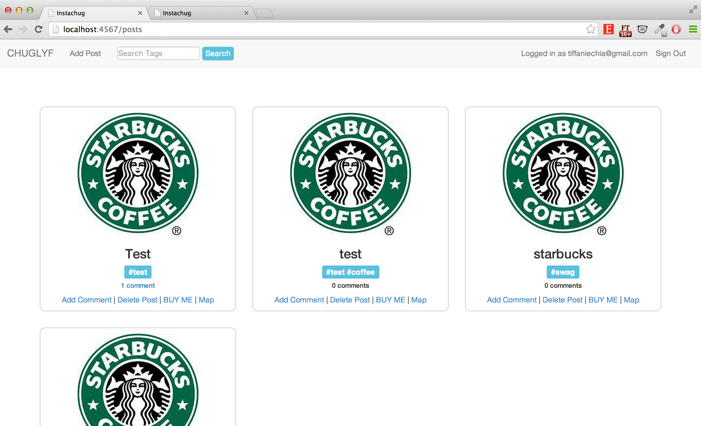
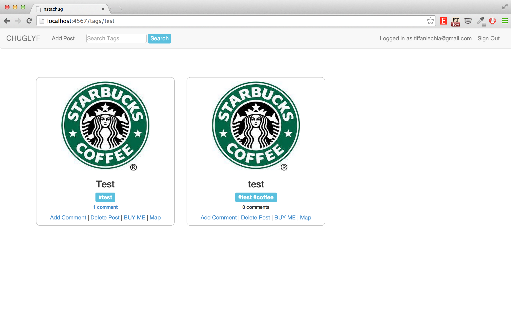
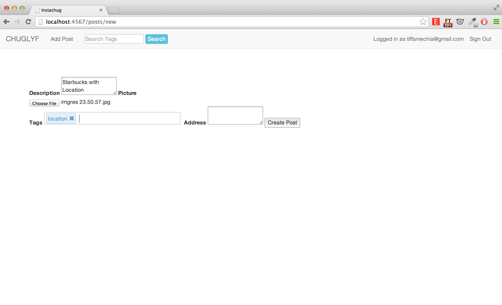
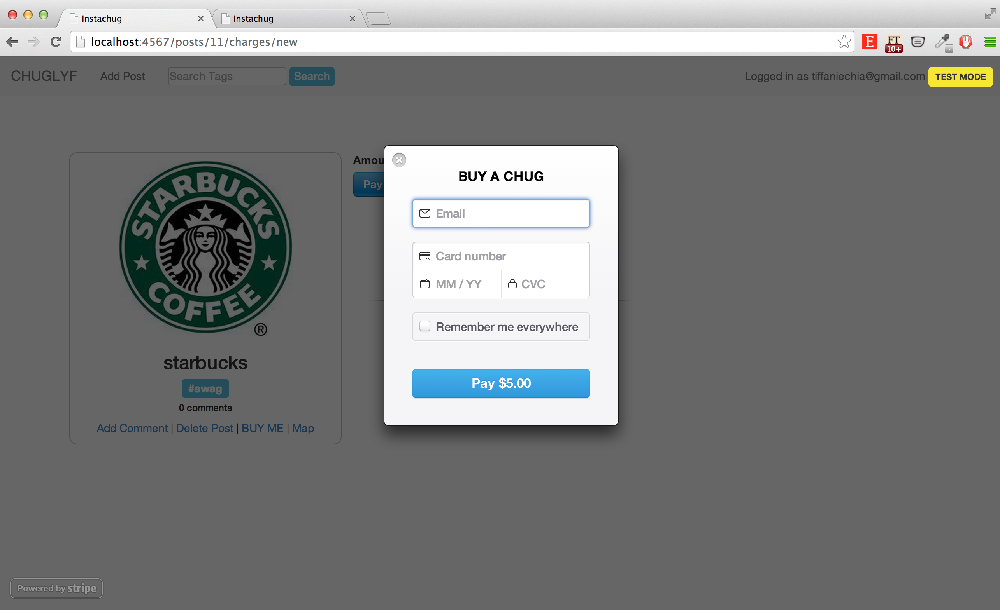

## Instagram Clone - Instachug

For week 9 at [Makers Academy](http://makersacademy.com), we were tasked to build a web application that replicated the core functionalities that Instagram has.

The app has several core features which included:

 - User login & authentication
 - Posts uploading, created with a picture, hashtags, and location
 - Able to transform tags in hashtags
 - Ability to delete own post
 - Ability to add comments
 - Tag search functionality
 - Ability to buy pictures
 - Map view functionalities

The task was set by [Alex Peattie](https://github.com/alexpeattie).

(Week 9)
##

### Home page

### Search by tags

### Add Post

### Payment through Stripe

##Technologies Used
 - Ruby
 - Ruby on Rails
 - Websockets
 - Stripe API for payment functionalities
 - Google Maps API
 - Devise Gem for user authorization
 - Inputosaurus Gem
 - AWS for static file hosting
 - Javascript & JQuery
 - HTML
 - CSS
 - BootStrap
 - Postgres sql
 - TDD with RSpec, Capybara, and FactoryGirl

 ##Collaborators
 - [Andrew Cumine](https://github.com/ajcumine)
 - [Tiffanie Chia](https://github.com/tiffaniechia)
